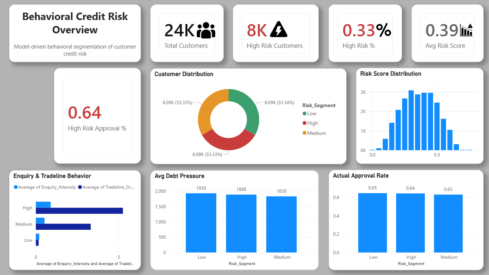
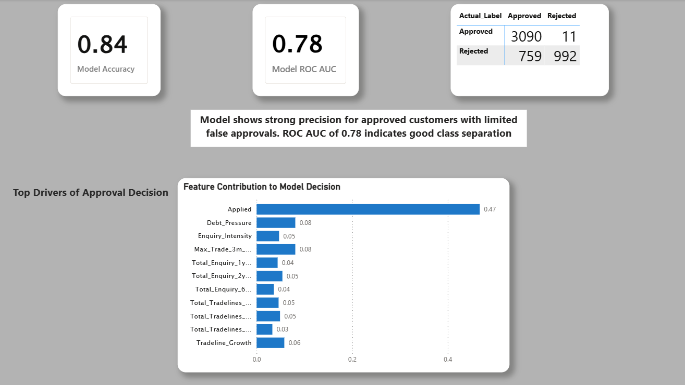
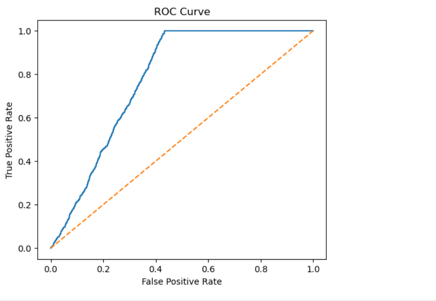
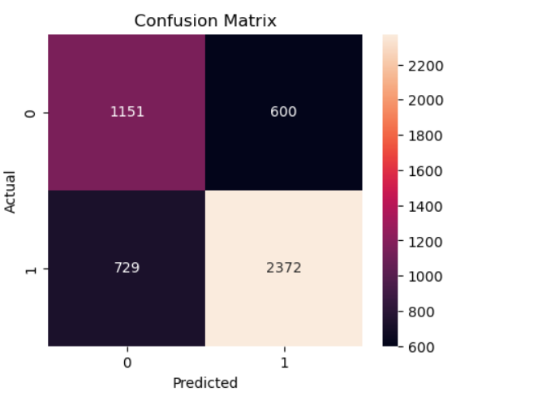
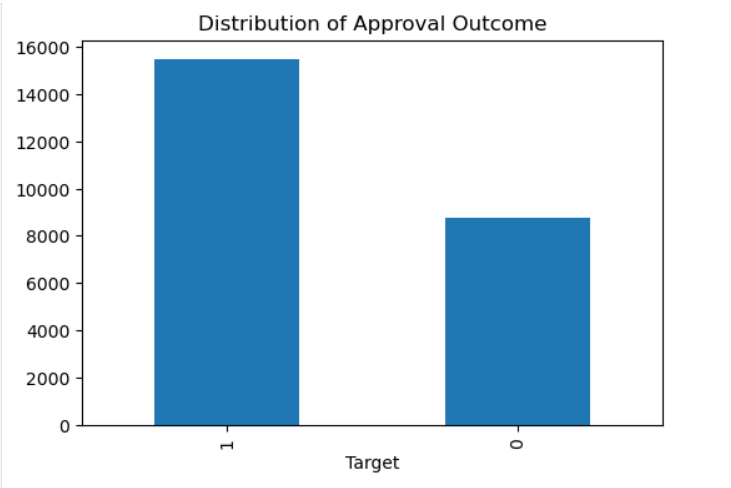

# 🧠 Behavioral Credit Risk Analysis & ML Dashboard

End-to-end credit risk analysis using **SQL, Python (Machine Learning), and Power BI**.

This project builds a behavioral credit risk model and transforms it into an executive-level interactive dashboard for business decision-making.

---

# 🚀 Project Overview

Financial institutions must balance approval rates with credit risk exposure.

This project:

- Segments customers based on behavioral attributes
- Builds a machine learning classification model
- Evaluates model performance
- Identifies key drivers influencing approval decisions
- Translates results into a business-ready Power BI dashboard

---

## 🔄 End-to-End Workflow

### 1️⃣ Raw Data Collection
The project begins with a structured customer credit dataset containing behavioral attributes such as:
- Credit enquiries
- Tradeline history
- Debt pressure indicators
- Application status
- Approval outcome (Target)

---

### 2️⃣ SQL – Data Cleaning & Feature Engineering

Using SQL, the dataset was prepared for modeling:

- Removed null or inconsistent records
- Standardized categorical variables
- Created derived behavioral metrics
- Engineered risk segmentation logic
- Exported cleaned dataset for ML pipeline

Output:
`credit_risk_cleaned.csv`

---

### 3️⃣ Python – EDA & Model Training

Using Python (Pandas + Scikit-learn):

- Performed exploratory data analysis
- Analyzed distributions & correlations
- Split data into train/test sets
- Trained Logistic Regression model
- Evaluated model using:
  - Accuracy
  - ROC AUC
  - Confusion Matrix
- Extracted feature importance values

Output:
- Model metrics
- Feature importance scores
- Predictions dataset

---

### 4️⃣ Model Evaluation & Interpretation

The model achieved:

- Accuracy: 0.84
- ROC AUC: 0.78

Insights:
- Strong precision for approved customers
- Limited false approvals
- Good separation between classes

---

### 5️⃣ Power BI – Business Dashboard

Model outputs and behavioral segments were loaded into Power BI.

Two dashboards were built:

- Executive Behavioral Risk Overview
- Model Performance & Feature Drivers

These dashboards provide:
- Risk segmentation insights
- Approval rate analysis
- Behavioral distribution
- Feature contribution transparency

---

### Final Outcome

An end-to-end credit risk analytics solution integrating:
SQL → Python (ML) → Power BI

This enables data-driven credit approval monitoring and risk optimization.

# 🛠 Tech Stack

- **SQL** – Data cleaning & feature engineering
- **Python**
  - Pandas
  - NumPy
  - Scikit-learn
  - Matplotlib / Seaborn
- **Machine Learning Model** – Logistic Regression
- **Power BI** – Dashboard & visualization

---

## 📂 Repository Structure

    behavioral-credit-risk-analysis/
    │
    ├── data/
    │   ├── raw/
    │   │   └── credit_risk_raw.csv
    │   │
    │   └── processed/
    │       └── credit_risk_cleaned.csv
    │
    ├── sql/
    │   ├── data_cleaning.sql
    │   ├── feature_engineering.sql
    │   └── model_dataset_query.sql
    │
    ├── python/
    │   ├── EDA.ipynb
    │   ├── model_training.ipynb
    │   ├── model_evaluation.ipynb
    │   └── requirements.txt
    │
    ├── powerbi/
    │   └── Behavioral_Credit_Risk.pbix
    │
    ├── images/
    │   ├── overview_page.png
    │   └── model_performance_page.png
    │
    └── README.md

---

# 📊 Dashboard Preview

## 1️⃣ Behavioral Risk Overview

- Total Customers
- High Risk Customers
- Risk % Distribution
- Approval Rates by Segment
- Behavioral Score Histogram
- Debt Pressure & Enquiry Patterns

---

## 2️⃣ Model Performance & Feature Drivers

- Model Accuracy
- ROC AUC
- Confusion Matrix
- Feature Importance Ranking
- Business Interpretation

---

# 📊 Model Evaluation Visualizations

## 🔹 ROC Curve

The ROC Curve demonstrates the model’s ability to distinguish between approved and rejected customers.

- ROC AUC = 0.78
- Strong class separation above random baseline

---

## 🔹 Confusion Matrix

Shows prediction breakdown:

- True Approvals
- True Rejections
- False Approvals
- False Rejections

---

## 🔹 Target Distribution

Displays class balance of approval outcomes in dataset.

---

# 🔍 Key Insights Discovered

### 📌 1. Application Status is Strongest Driver
The variable `Applied` contributes ~47% of model importance.

### 📌 2. Debt Pressure Matters
Customers with higher debt pressure show higher rejection probability.

### 📌 3. Enquiry Intensity Correlates with Risk
Frequent credit inquiries increase risk probability.

### 📌 4. Tradeline Behavior Impacts Decision
Recent tradeline changes significantly influence outcomes.

---

# ⚠ Challenges Faced During Development

### 1️⃣ Data Cleaning Issues
- Missing values in credit history fields
- Inconsistent categorical encoding
- Null handling required before model training

### 2️⃣ Feature Engineering Decisions
- Determining which inquiry windows (1Y, 2Y, 6M) were meaningful
- Avoiding multicollinearity in correlated features

### 3️⃣ Model Interpretation
- Ensuring feature importance was properly normalized
- Avoiding misleading aggregation in Power BI

### 4️⃣ Power BI Adjustments
- Fixed incorrect aggregation (Average vs Sum)
- Cleaned visual formatting
- Improved histogram clarity
- Adjusted data colors for consistent theme
- Refined confusion matrix labeling
- Balanced executive vs analytical view

---

# 🎨 Dashboard Design Decisions

- Executive-friendly KPI cards
- Clear behavioral segmentation
- Minimalist theme
- Strong contrast for High Risk metrics
- Business-readable interpretation block

---

# 📌 Business Impact

This dashboard enables:

- Risk-based approval monitoring
- Identification of approval drivers
- Operational risk analysis
- Model transparency for stakeholders
- Data-driven credit strategy decisions

---

# 🔄 Future Improvements

- Add threshold optimization tuning
- Add Precision-Recall curve visualization
- Implement XGBoost comparison model
- Add Drill-through customer level detail
- Deploy model API for real-time scoring

---

# ⭐ If You Found This Useful

Feel free to star the repository!
